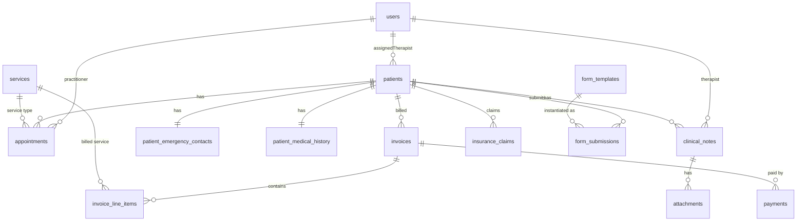

# DeePhysio Clinic Management — Backend Requirements Report

> **Source**: Extracted entirely from frontend code analysis (80 page files, [App.jsx](file:///d:/KIAAN/DeePhysio_clinic_management/deephysio/src/App.jsx) router, [Sidebar.jsx](file:///d:/KIAAN/DeePhysio_clinic_management/deephysio/src/components/Sidebar.jsx), context providers)
> **Date**: 2026-03-27
> **Frontend Stack**: React.js + Vite + TailwindCSS (Phase 1 — UI only, all data currently in localStorage)

---

## 1. System Modules

| # | Module | Frontend Pages | Route Prefix |
|---|--------|---------------|--------------|
| 1 | **Authentication** | [Login.jsx](file:///d:/KIAAN/DeePhysio_clinic_management/deephysio/src/pages/Login.jsx) | `/login` (catch-all when unauthenticated) |
| 2 | **Dashboard** | [Dashboard.jsx](file:///d:/KIAAN/DeePhysio_clinic_management/deephysio/src/pages/Dashboard.jsx) | `/` |
| 3 | **Appointments** | [Appointments.jsx](file:///d:/KIAAN/DeePhysio_clinic_management/deephysio/src/pages/Appointments.jsx), [BookAppointment.jsx](file:///d:/KIAAN/DeePhysio_clinic_management/deephysio/src/pages/BookAppointment.jsx), [Waitlist.jsx](file:///d:/KIAAN/DeePhysio_clinic_management/deephysio/src/pages/Waitlist.jsx), [Availability.jsx](file:///d:/KIAAN/DeePhysio_clinic_management/deephysio/src/pages/Availability.jsx), [AddTimeBlock.jsx](file:///d:/KIAAN/DeePhysio_clinic_management/deephysio/src/pages/AddTimeBlock.jsx), [BookingSettings.jsx](file:///d:/KIAAN/DeePhysio_clinic_management/deephysio/src/pages/BookingSettings.jsx) | `/appointments/*` |
| 4 | **Patients (CRM)** | [Patients.jsx](file:///d:/KIAAN/DeePhysio_clinic_management/deephysio/src/pages/Patients.jsx), [AddPatient.jsx](file:///d:/KIAAN/DeePhysio_clinic_management/deephysio/src/pages/AddPatient.jsx), [PatientProfile.jsx](file:///d:/KIAAN/DeePhysio_clinic_management/deephysio/src/pages/PatientProfile.jsx), [VisitHistory.jsx](file:///d:/KIAAN/DeePhysio_clinic_management/deephysio/src/pages/VisitHistory.jsx) | `/patients/*` |
| 5 | **Clinical Notes** | [ClinicalNotes.jsx](file:///d:/KIAAN/DeePhysio_clinic_management/deephysio/src/pages/ClinicalNotes.jsx), [NewNote.jsx](file:///d:/KIAAN/DeePhysio_clinic_management/deephysio/src/pages/NewNote.jsx), [ViewNote.jsx](file:///d:/KIAAN/DeePhysio_clinic_management/deephysio/src/pages/ViewNote.jsx), [SOAPNotePage.jsx](file:///d:/KIAAN/DeePhysio_clinic_management/deephysio/src/pages/SOAPNotePage.jsx), [RMDQAssessment.jsx](file:///d:/KIAAN/DeePhysio_clinic_management/deephysio/src/pages/RMDQAssessment.jsx), [HomeExercises.jsx](file:///d:/KIAAN/DeePhysio_clinic_management/deephysio/src/pages/HomeExercises.jsx), [TreatmentPlan.jsx](file:///d:/KIAAN/DeePhysio_clinic_management/deephysio/src/pages/TreatmentPlan.jsx), [PatientSurvey.jsx](file:///d:/KIAAN/DeePhysio_clinic_management/deephysio/src/pages/PatientSurvey.jsx), [DischargeSummary.jsx](file:///d:/KIAAN/DeePhysio_clinic_management/deephysio/src/pages/DischargeSummary.jsx), [NoteTemplates.jsx](file:///d:/KIAAN/DeePhysio_clinic_management/deephysio/src/pages/NoteTemplates.jsx), [CreateTemplate.jsx](file:///d:/KIAAN/DeePhysio_clinic_management/deephysio/src/pages/CreateTemplate.jsx), [Attachments.jsx](file:///d:/KIAAN/DeePhysio_clinic_management/deephysio/src/pages/Attachments.jsx) | `/notes/*` |
| 6 | **Communication** | [Communication.jsx](file:///d:/KIAAN/DeePhysio_clinic_management/deephysio/src/pages/Communication.jsx), [SMSChat.jsx](file:///d:/KIAAN/DeePhysio_clinic_management/deephysio/src/pages/SMSChat.jsx), [EmailMessages.jsx](file:///d:/KIAAN/DeePhysio_clinic_management/deephysio/src/pages/EmailMessages.jsx), [BulkMessaging.jsx](file:///d:/KIAAN/DeePhysio_clinic_management/deephysio/src/pages/BulkMessaging.jsx), [Telehealth.jsx](file:///d:/KIAAN/DeePhysio_clinic_management/deephysio/src/pages/Telehealth.jsx), [CommTemplates.jsx](file:///d:/KIAAN/DeePhysio_clinic_management/deephysio/src/pages/CommTemplates.jsx) | `/communication/*` |
| 7 | **Billing & Payments** | [Billing.jsx](file:///d:/KIAAN/DeePhysio_clinic_management/deephysio/src/pages/Billing.jsx), [NewInvoice.jsx](file:///d:/KIAAN/DeePhysio_clinic_management/deephysio/src/pages/NewInvoice.jsx), [Payments.jsx](file:///d:/KIAAN/DeePhysio_clinic_management/deephysio/src/pages/Payments.jsx), [PaymentHistory.jsx](file:///d:/KIAAN/DeePhysio_clinic_management/deephysio/src/pages/PaymentHistory.jsx), [BillingPatientDetail.jsx](file:///d:/KIAAN/DeePhysio_clinic_management/deephysio/src/pages/BillingPatientDetail.jsx), [RecordPaymentPage.jsx](file:///d:/KIAAN/DeePhysio_clinic_management/deephysio/src/pages/RecordPaymentPage.jsx), [InvoiceDetailPage.jsx](file:///d:/KIAAN/DeePhysio_clinic_management/deephysio/src/pages/InvoiceDetailPage.jsx), [PaymentReminders.jsx](file:///d:/KIAAN/DeePhysio_clinic_management/deephysio/src/pages/PaymentReminders.jsx), [AddReminderRulePage.jsx](file:///d:/KIAAN/DeePhysio_clinic_management/deephysio/src/pages/AddReminderRulePage.jsx), [PricingServices.jsx](file:///d:/KIAAN/DeePhysio_clinic_management/deephysio/src/pages/PricingServices.jsx), [AddServicePage.jsx](file:///d:/KIAAN/DeePhysio_clinic_management/deephysio/src/pages/AddServicePage.jsx), [EditServicePage.jsx](file:///d:/KIAAN/DeePhysio_clinic_management/deephysio/src/pages/EditServicePage.jsx), [InsuranceClaims.jsx](file:///d:/KIAAN/DeePhysio_clinic_management/deephysio/src/pages/InsuranceClaims.jsx), [NewClaimPage.jsx](file:///d:/KIAAN/DeePhysio_clinic_management/deephysio/src/pages/NewClaimPage.jsx), [ClaimDetailPage.jsx](file:///d:/KIAAN/DeePhysio_clinic_management/deephysio/src/pages/ClaimDetailPage.jsx), [SubmitBatchPage.jsx](file:///d:/KIAAN/DeePhysio_clinic_management/deephysio/src/pages/SubmitBatchPage.jsx) | `/billing/*` |
| 8 | **Forms & Intake** | [FormsList.jsx](file:///d:/KIAAN/DeePhysio_clinic_management/deephysio/src/pages/FormsList.jsx), [FormBuilder.jsx](file:///d:/KIAAN/DeePhysio_clinic_management/deephysio/src/pages/FormBuilder.jsx), [FormFill.jsx](file:///d:/KIAAN/DeePhysio_clinic_management/deephysio/src/pages/FormFill.jsx) | `/forms/*` |
| 9 | **Analytics** | [Analytics.jsx](file:///d:/KIAAN/DeePhysio_clinic_management/deephysio/src/pages/Analytics.jsx), [RevenueReports.jsx](file:///d:/KIAAN/DeePhysio_clinic_management/deephysio/src/pages/RevenueReports.jsx), [PatientGrowth.jsx](file:///d:/KIAAN/DeePhysio_clinic_management/deephysio/src/pages/PatientGrowth.jsx), [ServicePopularity.jsx](file:///d:/KIAAN/DeePhysio_clinic_management/deephysio/src/pages/ServicePopularity.jsx), [StaffPerformance.jsx](file:///d:/KIAAN/DeePhysio_clinic_management/deephysio/src/pages/StaffPerformance.jsx), [MarketingAnalytics.jsx](file:///d:/KIAAN/DeePhysio_clinic_management/deephysio/src/pages/MarketingAnalytics.jsx) | `/analytics/*` |
| 10 | **Marketing** | [Marketing.jsx](file:///d:/KIAAN/DeePhysio_clinic_management/deephysio/src/pages/Marketing.jsx), [MarketingSegments.jsx](file:///d:/KIAAN/DeePhysio_clinic_management/deephysio/src/pages/MarketingSegments.jsx), [MarketingAutomation.jsx](file:///d:/KIAAN/DeePhysio_clinic_management/deephysio/src/pages/MarketingAutomation.jsx) | `/marketing/*` (via Sidebar) |
| 11 | **Settings** | [Settings.jsx](file:///d:/KIAAN/DeePhysio_clinic_management/deephysio/src/pages/Settings.jsx), [UserManagement.jsx](file:///d:/KIAAN/DeePhysio_clinic_management/deephysio/src/pages/UserManagement.jsx), [AddUser.jsx](file:///d:/KIAAN/DeePhysio_clinic_management/deephysio/src/pages/AddUser.jsx), [EditUser.jsx](file:///d:/KIAAN/DeePhysio_clinic_management/deephysio/src/pages/EditUser.jsx), [UserAudit.jsx](file:///d:/KIAAN/DeePhysio_clinic_management/deephysio/src/pages/UserAudit.jsx), [RolesPermissions.jsx](file:///d:/KIAAN/DeePhysio_clinic_management/deephysio/src/pages/RolesPermissions.jsx), [AddRole.jsx](file:///d:/KIAAN/DeePhysio_clinic_management/deephysio/src/pages/AddRole.jsx), [ClinicDetails.jsx](file:///d:/KIAAN/DeePhysio_clinic_management/deephysio/src/pages/ClinicDetails.jsx), [SecuritySettings.jsx](file:///d:/KIAAN/DeePhysio_clinic_management/deephysio/src/pages/SecuritySettings.jsx), [NotificationSettings.jsx](file:///d:/KIAAN/DeePhysio_clinic_management/deephysio/src/pages/NotificationSettings.jsx), [Integrations.jsx](file:///d:/KIAAN/DeePhysio_clinic_management/deephysio/src/pages/Integrations.jsx), [IntegrationService.jsx](file:///d:/KIAAN/DeePhysio_clinic_management/deephysio/src/pages/IntegrationService.jsx), [LinkProvider.jsx](file:///d:/KIAAN/DeePhysio_clinic_management/deephysio/src/pages/LinkProvider.jsx), [MultiLocation.jsx](file:///d:/KIAAN/DeePhysio_clinic_management/deephysio/src/pages/MultiLocation.jsx), [DataBackup.jsx](file:///d:/KIAAN/DeePhysio_clinic_management/deephysio/src/pages/DataBackup.jsx), [ClinicManual.jsx](file:///d:/KIAAN/DeePhysio_clinic_management/deephysio/src/pages/ClinicManual.jsx) | `/settings/*` |

---

## 2. All Forms with Exact Field Names

### 2.1 Login Form
**File**: [Login.jsx](file:///d:/KIAAN/DeePhysio_clinic_management/deephysio/src/pages/Login.jsx)

| Field | Type | Required | Notes |
|-------|------|----------|-------|
| `email` | email | ✅ | HTML5 email validation |
| `password` | password | ✅ | — |
| `selectedRole` | select (button) | ✅ | `admin` / `therapist` / `receptionist` / `billing` |

---

### 2.2 Add Patient Form
**File**: [AddPatient.jsx](file:///d:/KIAAN/DeePhysio_clinic_management/deephysio/src/pages/AddPatient.jsx)

| Field | State Key | Type | Required |
|-------|-----------|------|----------|
| First Name | `firstName` | text | ✅ |
| Last Name | `lastName` | text | ✅ |
| Date of Birth | `dob` | date | ❌ |
| Gender | `gender` | select | ❌ (default: `Male`) |
| Phone Number | `phone` | tel | ✅ |
| Email Address | `email` | email | ❌ |
| Address | `address` | textarea | ❌ |
| Patient Type | `patientType` | radio | ❌ (default: `Normal`, options: `Normal` / `Emergency`) |
| Behaviour Flag | `behaviour` | button-group | ❌ (default: `normal`, options: `red` / `orange` / `yellow` / `green`) |
| **Emergency Contact** |||
| Contact Name | `emergencyContact.name` | text | Conditional ✅ (if `patientType === 'Emergency'`) |
| Phone | `emergencyContact.phone` | tel | Conditional ✅ (if `patientType === 'Emergency'`) |
| Relationship | `emergencyContact.relation` | text | ❌ |
| **Medical History** |||
| Existing Conditions | `medicalHistory.existingConditions` | text | ❌ |
| Allergies | `medicalHistory.allergies` | text | ❌ |
| Chronic Diseases | `medicalHistory.chronicDiseases` | text | ❌ |
| Previous Surgeries | `medicalHistory.surgeries` | text | ❌ |
| Clinical Notes (long-term) | `medicalHistory.longTermNotes` | textarea | ❌ |

> **Role restriction**: Receptionist cannot see **Patient Behaviour** and **Medical History** sections.

---

### 2.3 Book Appointment Form
**File**: [BookAppointment.jsx](file:///d:/KIAAN/DeePhysio_clinic_management/deephysio/src/pages/BookAppointment.jsx)

| Field | State Key | Type | Required |
|-------|-----------|------|----------|
| Patient | `patient` / `patientId` | search-autocomplete | ✅ |
| Service | `service` | card-select (id) | ✅ |
| Practitioner | `practitioner` | card-select (id) | ✅ |
| Date | [date](file:///d:/KIAAN/DeePhysio_clinic_management/deephysio/src/pages/NewInvoice.jsx#53-58) | date | ✅ |
| Time | `time` | select / quick-select buttons | ✅ |
| Room | `room` | select | ✅ |
| Clinical Notes | `notes` | textarea | ❌ |

> **Role restriction**: Therapist role auto-assigns themselves as `practitioner`; practitioner picker is hidden.

---

### 2.4 New Clinical Note (SOAP) Form
**File**: [NewNote.jsx](file:///d:/KIAAN/DeePhysio_clinic_management/deephysio/src/pages/NewNote.jsx)

| Field | State Key | Type | Required |
|-------|-----------|------|----------|
| Patient | `selectedPatient` | select (patient id) | ✅ |
| Note Type | `noteType` | select | ❌ (default: `Initial Assessment`) |
| Template | `selectedTemplate` | select | ❌ |
| Subjective | `notes.subjective` | textarea | ❌ |
| Objective | `notes.objective` | textarea | ❌ |
| Assessment | `notes.assessment` | textarea | ❌ |
| Plan | `notes.plan` | textarea | ❌ |

**Note Types**: `Initial Assessment`, `Progress Report`, `Discharge Summary`, `Referral Note`
**Save Statuses**: `Draft`, `Completed`

---

### 2.5 New Invoice Form
**File**: [NewInvoice.jsx](file:///d:/KIAAN/DeePhysio_clinic_management/deephysio/src/pages/NewInvoice.jsx)

| Field | State Key | Type | Required |
|-------|-----------|------|----------|
| Patient | `newInvoice.patient` | select | ✅ |
| Date | `newInvoice.date` | date | ✅ |
| Payment Terms | `newInvoice.terms` | select | ❌ (default: `Net 30`) |
| Notes | `newInvoice.notes` | textarea | ❌ |
| **Line Items** (dynamic array) |||
| Service Description | `lineItems[].service` | text | ✅ |
| Rate | `lineItems[].rate` | number | ✅ |
| Quantity | `lineItems[].qty` | number | ✅ |

**Auto-calculated**: `subtotal`, `tax` (20%), `total`
**Payment Terms Options**: `Due on Receipt`, `Net 15 Days`, `Net 30 Days`, `Advanced Retainer`

---

### 2.6 Record Payment Form
**File**: [RecordPaymentPage.jsx](file:///d:/KIAAN/DeePhysio_clinic_management/deephysio/src/pages/RecordPaymentPage.jsx)

| Field | State Key | Type | Required |
|-------|-----------|------|----------|
| Patient | `newPayment.patient` | text | ✅ |
| Amount (£) | `newPayment.amount` | number | ✅ |
| Payment Method | `newPayment.method` | select | ❌ |
| Date | `newPayment.date` | date | ❌ |
| Status | `newPayment.status` | select | ❌ (default: `Paid`) |
| Description | `newPayment.description` | textarea | ❌ |

**Method Options**: `Visa •• 4242`, `Mastercard •• 8888`, `Direct Deposit`, `Cash`
**Status Options**: `Paid`, `Pending`, `Failed`

---

### 2.7 Insurance Claim Form
**File**: [NewClaimPage.jsx](file:///d:/KIAAN/DeePhysio_clinic_management/deephysio/src/pages/NewClaimPage.jsx)

| Field | Type | Required |
|-------|------|----------|
| Patient Name | text | ✅ |
| Service Date | date | ✅ |
| Insurance Carrier | select | ✅ |
| Reimbursement Amount (£) | number | ✅ |
| ICD-10 Code | text | ✅ |
| Service Description | text | ✅ |

**Carrier Options**: `BUPA INTERNATIONAL`, `AXA HEALTHCARE`, `VITALITY HEALTH`, `CIGNA GLOBAL`

---

### 2.8 Add User Form
**File**: [AddUser.jsx](file:///d:/KIAAN/DeePhysio_clinic_management/deephysio/src/pages/AddUser.jsx)

| Field | State Key | Type | Required |
|-------|-----------|------|----------|
| Full Name | `name` | text | ✅ |
| Email Address | `email` | email | ✅ |
| Role | `role` | select | ❌ (default: `Therapist`) |
| Status | `status` | select | ❌ (default: `Active`) |

**Role Options**: `Admin`, `Therapist`, `Receptionist`, `Billing Staff`
**Status Options**: `Active`, `Inactive`

---

### 2.9 Add Role Form
**File**: [AddRole.jsx](file:///d:/KIAAN/DeePhysio_clinic_management/deephysio/src/pages/AddRole.jsx)

| Field | State Key | Type | Required |
|-------|-----------|------|----------|
| Role Name | `name` | text | ✅ |
| Access Template | `template` | select | ❌ |
| Security Level | `securityLevel` | select | ❌ |

**Template Options**: `Clinical Partition Only`, `Financial & Billing Node`, `Operational & Frontend`, `Unrestricted Institutional Access`
**Security Levels**: `Level 1` to `Level 5`

---

### 2.10 Add Service (Pricing) Form
**File**: [AddServicePage.jsx](file:///d:/KIAAN/DeePhysio_clinic_management/deephysio/src/pages/AddServicePage.jsx)

| Field | State Key | Type | Required |
|-------|-----------|------|----------|
| Service Name | `name` | text | ✅ |
| Category | `category` | select | ❌ (default: `Physiotherapy`) |
| Price (£) | `price` | number | ✅ |
| Duration | `duration` | select | ❌ (default: `45m`) |
| Status | `status` | select | ❌ (default: `Active`) |

**Category Options**: `Physiotherapy`, `Massage`, `Specialist`, `Diagnostics`
**Duration Options**: `15m`, `30m`, `45m`, `60m`, `90m`

---

### 2.11 Add Waitlist Entry Form
**File**: [Waitlist.jsx](file:///d:/KIAAN/DeePhysio_clinic_management/deephysio/src/pages/Waitlist.jsx) (modal)

| Field | State Key | Type | Required |
|-------|-----------|------|----------|
| Patient Name | `patient` | text | ✅ |
| Requested Service | `requestedService` | select | ❌ |
| Priority Level | `status` | select | ❌ (default: `Medium`) |
| Preferred Date | `preferredDate` | date | ❌ |
| Preferred Time | `preferredTime` | time | ❌ |
| Contact Number | `contactNumber` | tel | ❌ |

**Priority Options**: `Low`, `Medium`, `High`

---

### 2.12 Payment Reminder Rule Form
**File**: [AddReminderRulePage.jsx](file:///d:/KIAAN/DeePhysio_clinic_management/deephysio/src/pages/AddReminderRulePage.jsx)

| Field | State Key | Type | Required |
|-------|-----------|------|----------|
| Patient | `patient` | text | ✅ |
| Overdue Amount (£) | `amount` | number | ✅ |
| Threshold Age | [age](file:///d:/KIAAN/DeePhysio_clinic_management/deephysio/src/pages/NewClaimPage.jsx#12-152) | select | ❌ (default: `7 Days`) |
| Communication Channel | `method` | select | ❌ (default: `Email`) |
| Logic Preset | `status` | select | ❌ |

**Age Options**: `7 Days`, `14 Days`, `30 Days`, `60+ Days`
**Channel Options**: `Email`, `SMS`, `Dual`
**Logic Presets**: `Courteous Prompt`, `First Warning`, `Third Warning`, `Final Notice`

---

### 2.13 Form Builder (Dynamic Form Creation)
**File**: [FormBuilder.jsx](file:///d:/KIAAN/DeePhysio_clinic_management/deephysio/src/pages/FormBuilder.jsx)

| Field | State Key | Type | Required |
|-------|-----------|------|----------|
| Form Name | `formName` | text | ✅ |
| Category | `category` | select | ❌ (default: `Patient Intake`) |
| **Dynamic Fields** (array) |||
| Field Type | `fields[].type` | — | — |
| Label | `fields[].label` | text | — |
| Required Toggle | `fields[].required` | boolean | — |
| Options | `fields[].options` | text[] | (for dropdown/checkbox types) |

**Field Types**: `short` (Short Answer), `text` (Paragraph), `checkbox`, `dropdown`, [date](file:///d:/KIAAN/DeePhysio_clinic_management/deephysio/src/pages/NewInvoice.jsx#53-58), `signature`
**Category Options**: `Patient Intake`, `Medical History`, `Consent`, `Assessment`, `Treatment Plan`, `Home Exercises`

---

### 2.14 Clinical Note Template Form
**File**: [CreateTemplate.jsx](file:///d:/KIAAN/DeePhysio_clinic_management/deephysio/src/pages/CreateTemplate.jsx)

| Field | State Key | Type | Required |
|-------|-----------|------|----------|
| Template Name | `formData.name` | text | ✅ |
| Category | `formData.category` | select | ❌ (default: `Physiotherapy`) |
| Description | `formData.description` | textarea | ❌ |
| **Sections** (dynamic array) |||
| Section Title | `sections[].title` | text | — |
| Placeholder Text | `sections[].placeholder` | text | — |

**Category Options**: `Physiotherapy`, `Clinical`, `Rehabilitation`, `Prevention`, `Manual Therapy`, `Final`

---

### 2.15 Clinic Details Form
**File**: [ClinicDetails.jsx](file:///d:/KIAAN/DeePhysio_clinic_management/deephysio/src/pages/ClinicDetails.jsx)

| Field | Type | Default Value |
|-------|------|---------------|
| Clinic Name | text | `DeePhysio Clinic` |
| Phone | text | `+44 7123 456789` |
| Email | email | `hello@deephysio.com` |
| Address | text | `12 Clinical Way, Medical District` |
| City | text | `London` |
| Postcode | text | `W1G 6AQ` |
| Logo | file upload | — |

---

### 2.16 Add Time Block Form
**File**: [AddTimeBlock.jsx](file:///d:/KIAAN/DeePhysio_clinic_management/deephysio/src/pages/AddTimeBlock.jsx)

| Field | Type | Required |
|-------|------|----------|
| Block Type | select | ✅ |
| Practitioner | select | ✅ |
| Date | date | ✅ |
| Start Time | time | ✅ |
| End Time | time | ✅ |
| Reason/Notes | textarea | ❌ |

---

## 3. Required API Endpoints

### 3.1 Authentication
| Method | Endpoint | Request Body | Response |
|--------|----------|-------------|----------|
| `POST` | `/api/auth/login` | `{ email, password }` | `{ token, user: { id, name, email, role } }` |
| `POST` | `/api/auth/logout` | — | `{ success: true }` |
| `GET` | `/api/auth/me` | — | Current user profile |

---

### 3.2 Dashboard
| Method | Endpoint | Description |
|--------|----------|-------------|
| `GET` | `/api/dashboard/stats` | Aggregated stats: today's appointments, revenue, pending payments, new patients, no-shows, staff activity. **Filtered by role**. |
| `GET` | `/api/dashboard/chart/appointments` | Weekly appointment trend data (day, count) |
| `GET` | `/api/dashboard/chart/revenue` | Weekly revenue chart data (day, amount) |
| `GET` | `/api/dashboard/recent-bookings` | Recent bookings list with status filter. For therapist: filtered by `therapistId`. |
| `GET` | `/api/dashboard/recent-transactions` | Recent payment transactions (billing role view) |
| `GET` | `/api/dashboard/activity-log` | Today's activity log (activity type, patient, timestamp) |

---

### 3.3 Patients
| Method | Endpoint | Request Body / Params |
|--------|----------|-----------------------|
| `GET` | `/api/patients` | Query: `?search=&status=&page=&limit=` |
| `GET` | `/api/patients/:id` | — |
| `POST` | `/api/patients` | Full patient object (see Form 2.2) |
| `PUT` | `/api/patients/:id` | Updated patient fields |
| `DELETE` | `/api/patients/:id` | — |
| `GET` | `/api/patients/:id/visits` | Visit history for patient |
| `GET` | `/api/patients/:id/billing` | Billing summary for patient |
| `GET` | `/api/patients/:id/forms` | Submitted forms for patient |
| `GET` | `/api/patients/:id/documents` | Uploaded documents for patient |

---

### 3.4 Appointments
| Method | Endpoint | Request Body / Params |
|--------|----------|-----------------------|
| `GET` | `/api/appointments` | Query: `?date=&practitioner=&status=&view=day/week/month` |
| `GET` | `/api/appointments/:id` | — |
| `POST` | `/api/appointments` | `{ patientId, patientName, serviceId, practitionerId, date, startTime, endTime, room, notes }` |
| `PUT` | `/api/appointments/:id` | Updated fields |
| `PATCH` | `/api/appointments/:id/status` | `{ status }` — values: `Pending`, `Confirmed`, `Arrived`, `In Progress`, `Completed`, `No Show`, `Cancelled` |
| `DELETE` | `/api/appointments/:id` | — |
| `GET` | `/api/appointments/availability` | Query: `?practitioner=&date=` |
| `POST` | `/api/appointments/time-blocks` | `{ type, practitionerId, date, startTime, endTime, reason }` |
| `GET` | `/api/appointments/time-blocks` | Query: `?practitioner=&date=` |
| `DELETE` | `/api/appointments/time-blocks/:id` | — |

---

### 3.5 Waitlist
| Method | Endpoint | Request Body / Params |
|--------|----------|-----------------------|
| `GET` | `/api/waitlist` | Query: `?search=` |
| `POST` | `/api/waitlist` | `{ patient, requestedService, preferredDate, preferredTime, contactNumber, status (priority) }` |
| `DELETE` | `/api/waitlist/:id` | — |
| `POST` | `/api/waitlist/:id/convert` | Convert waitlist entry → appointment booking |

---

### 3.6 Clinical Notes
| Method | Endpoint | Request Body / Params |
|--------|----------|-----------------------|
| `GET` | `/api/notes` | Query: `?patientId=&therapistId=&type=&status=&search=` |
| `GET` | `/api/notes/:id` | — |
| `POST` | `/api/notes` | `{ patientId, noteType, subjective, objective, assessment, plan, status, attachments[] }` |
| `PUT` | `/api/notes/:id` | Updated note (including status change `Draft` → `Completed`) |
| `DELETE` | `/api/notes/:id` | — |
| `POST` | `/api/notes/draft` | Auto-save draft: `{ notes, patientId, noteType }` |
| `GET` | `/api/notes/draft` | Retrieve current user's draft |

---

### 3.7 Note Templates
| Method | Endpoint | Request Body / Params |
|--------|----------|-----------------------|
| `GET` | `/api/note-templates` | — |
| `GET` | `/api/note-templates/:id` | — |
| `POST` | `/api/note-templates` | `{ name, category, description, sections: [{ title, placeholder }] }` |
| `PUT` | `/api/note-templates/:id` | Updated template |
| `DELETE` | `/api/note-templates/:id` | — |

---

### 3.8 Attachments
| Method | Endpoint | Request Body / Params |
|--------|----------|-----------------------|
| `GET` | `/api/attachments` | Query: `?patientId=&noteId=` |
| `POST` | `/api/attachments` | Multipart form: file upload + metadata |
| `DELETE` | `/api/attachments/:id` | — |

---

### 3.9 Billing — Invoices
| Method | Endpoint | Request Body / Params |
|--------|----------|-----------------------|
| `GET` | `/api/invoices` | Query: `?status=&patient=&dateFrom=&dateTo=` |
| `GET` | `/api/invoices/:id` | — |
| `POST` | `/api/invoices` | `{ patientId, date, terms, notes, lineItems: [{ service, rate, qty }] }` |
| `PUT` | `/api/invoices/:id` | — |
| `PATCH` | `/api/invoices/:id/status` | `{ status }` — `Pending`, `Paid`, `Overdue`, `Cancelled` |

---

### 3.10 Billing — Payments
| Method | Endpoint | Request Body / Params |
|--------|----------|-----------------------|
| `GET` | `/api/payments` | Query: `?status=&method=&dateFrom=&dateTo=` |
| `GET` | `/api/payments/:id` | — |
| `POST` | `/api/payments` | `{ patient, amount, method, date, status, description, invoiceId? }` |
| `GET` | `/api/payments/history` | Payment history with filters |

---

### 3.11 Billing — Insurance Claims
| Method | Endpoint | Request Body / Params |
|--------|----------|-----------------------|
| `GET` | `/api/insurance-claims` | Query: `?status=&carrier=` |
| `GET` | `/api/insurance-claims/:id` | — |
| `POST` | `/api/insurance-claims` | `{ patientId, serviceDate, carrier, amount, icd10Code, description }` |
| `PATCH` | `/api/insurance-claims/:id/status` | `{ status }` |
| `POST` | `/api/insurance-claims/batch` | Submit batch of claims |

---

### 3.12 Billing — Payment Reminders
| Method | Endpoint | Request Body / Params |
|--------|----------|-----------------------|
| `GET` | `/api/payment-reminders` | — |
| `POST` | `/api/payment-reminders` | `{ patient, amount, age, method, status, isPaused }` |
| `PATCH` | `/api/payment-reminders/:id/toggle` | Pause/Resume |
| `DELETE` | `/api/payment-reminders/:id` | — |

---

### 3.13 Billing — Services / Pricing
| Method | Endpoint | Request Body / Params |
|--------|----------|-----------------------|
| `GET` | `/api/services` | — |
| `GET` | `/api/services/:id` | — |
| `POST` | `/api/services` | `{ name, category, price, duration, status }` |
| `PUT` | `/api/services/:id` | Updated service |
| `DELETE` | `/api/services/:id` | — |

---

### 3.14 Communication
| Method | Endpoint | Request Body / Params |
|--------|----------|-----------------------|
| `GET` | `/api/communication/sms` | SMS conversations |
| `POST` | `/api/communication/sms` | `{ to, message }` |
| `GET` | `/api/communication/email` | Email threads |
| `POST` | `/api/communication/email` | `{ to, subject, body, templateId? }` |
| `POST` | `/api/communication/bulk` | `{ recipients[], channel, message, templateId? }` |
| `GET` | `/api/communication/templates` | Message templates |
| `POST` | `/api/communication/templates` | `{ name, type, subject, body, variables[] }` |
| `PUT` | `/api/communication/templates/:id` | — |
| `DELETE` | `/api/communication/templates/:id` | — |
| `POST` | `/api/telehealth/session` | Create telehealth session |

---

### 3.15 Forms & Intake
| Method | Endpoint | Request Body / Params |
|--------|----------|-----------------------|
| `GET` | `/api/forms` | List form templates |
| `GET` | `/api/forms/:id` | Get form template with fields |
| `POST` | `/api/forms` | `{ name, category, fields: [{ type, label, required, options[] }] }` |
| `PUT` | `/api/forms/:id` | Update form template |
| `DELETE` | `/api/forms/:id` | — |
| `POST` | `/api/forms/:id/submit` | `{ patientId, responses: [{ fieldId, value }] }` |
| `GET` | `/api/forms/:id/submissions` | Get all submissions for a form |

---

### 3.16 Analytics & Reports
| Method | Endpoint | Description |
|--------|----------|-------------|
| `GET` | `/api/analytics/overview` | Combined analytics dashboard data |
| `GET` | `/api/analytics/revenue` | Revenue reports with date range filter |
| `GET` | `/api/analytics/patient-growth` | Patient registration trends |
| `GET` | `/api/analytics/service-popularity` | Service usage breakdown |
| `GET` | `/api/analytics/staff-performance` | Staff performance metrics |
| `GET` | `/api/analytics/export` | Query: `?format=csv|pdf&type=` |

---

### 3.17 Settings — Users
| Method | Endpoint | Request Body / Params |
|--------|----------|-----------------------|
| `GET` | `/api/users` | — |
| `GET` | `/api/users/:id` | — |
| `POST` | `/api/users` | `{ name, email, role, status }` |
| `PUT` | `/api/users/:id` | Updated user fields |
| `DELETE` | `/api/users/:id` | — |
| `GET` | `/api/users/:id/audit` | User audit trail / action log |

---

### 3.18 Settings — Roles & Permissions
| Method | Endpoint | Request Body / Params |
|--------|----------|-----------------------|
| `GET` | `/api/roles` | — |
| `POST` | `/api/roles` | `{ name, template, securityLevel }` |
| `PUT` | `/api/roles/:id` | — |
| `DELETE` | `/api/roles/:id` | — |

---

### 3.19 Settings — Clinic
| Method | Endpoint | Request Body / Params |
|--------|----------|-----------------------|
| `GET` | `/api/clinic` | Get clinic details |
| `PUT` | `/api/clinic` | `{ name, phone, email, address, city, postcode, logo }` |
| `GET` | `/api/clinic/locations` | Multi-location list |
| `POST` | `/api/clinic/locations` | Add new location |
| `PUT` | `/api/clinic/locations/:id` | Update location |
| `DELETE` | `/api/clinic/locations/:id` | Remove location |

---

### 3.20 Settings — System
| Method | Endpoint | Description |
|--------|----------|-------------|
| `GET` | `/api/settings/notifications` | Notification preferences |
| `PUT` | `/api/settings/notifications` | Update notification settings |
| `GET` | `/api/settings/security` | Security settings (2FA, session timeout, etc.) |
| `PUT` | `/api/settings/security` | Update security settings |
| `POST` | `/api/settings/backup` | Trigger backup |
| `GET` | `/api/settings/backup/history` | Backup history |
| `GET` | `/api/integrations` | List external integrations |
| `POST` | `/api/integrations/:provider/connect` | Connect integration |
| `DELETE` | `/api/integrations/:provider/disconnect` | Disconnect integration |

---

## 4. Data Models (Tables)

### 4.1 `users`
| Column | Type | Constraints | Notes |
|--------|------|-------------|-------|
| [id](file:///d:/KIAAN/DeePhysio_clinic_management/deephysio/src/pages/BookAppointment.jsx#56-61) | string (PK) | auto-gen `US-XXX` | — |
| `name` | string | NOT NULL | — |
| `email` | string | NOT NULL, UNIQUE | — |
| `password` | string | NOT NULL | Hashed |
| `role` | enum | NOT NULL | `Admin`, `Therapist`, `Receptionist`, `Billing Staff` |
| `status` | enum | default `Active` | `Active`, `Inactive` |
| `createdAt` | timestamp | — | — |
| `updatedAt` | timestamp | — | — |

### 4.2 `roles`
| Column | Type | Notes |
|--------|------|-------|
| [id](file:///d:/KIAAN/DeePhysio_clinic_management/deephysio/src/pages/BookAppointment.jsx#56-61) | int (PK) | auto-increment |
| `name` | string | Role display name |
| `template` | string | Access partition template |
| `securityLevel` | string | Level 1–5 |

### 4.3 `patients`
| Column | Type | Constraints |
|--------|------|-------------|
| [id](file:///d:/KIAAN/DeePhysio_clinic_management/deephysio/src/pages/BookAppointment.jsx#56-61) | string (PK) | auto-gen `PID-XXXX` |
| `firstName` | string | NOT NULL |
| `lastName` | string | NOT NULL |
| `dob` | date | nullable |
| `gender` | enum | `Male`, `Female`, `Other` |
| `phone` | string | NOT NULL |
| `email` | string | nullable |
| `address` | text | nullable |
| `patientType` | enum | `Normal`, `Emergency` |
| `behaviour` | enum | `red`, `orange`, `yellow`, `green` |
| `status` | enum | default `Active` |
| `therapistId` | FK → users | Assigned therapist |
| `lastVisit` | date | — |
| `lastVisitType` | string | — |
| `createdAt` | timestamp | — |

### 4.4 `patient_emergency_contacts`
| Column | Type |
|--------|------|
| [id](file:///d:/KIAAN/DeePhysio_clinic_management/deephysio/src/pages/BookAppointment.jsx#56-61) | int (PK) |
| `patientId` | FK → patients |
| `name` | string |
| `phone` | string |
| `relation` | string |

### 4.5 `patient_medical_history`
| Column | Type |
|--------|------|
| [id](file:///d:/KIAAN/DeePhysio_clinic_management/deephysio/src/pages/BookAppointment.jsx#56-61) | int (PK) |
| `patientId` | FK → patients |
| `existingConditions` | text |
| `allergies` | text |
| `chronicDiseases` | text |
| `surgeries` | text |
| `longTermNotes` | text |

### 4.6 `appointments`
| Column | Type | Constraints |
|--------|------|-------------|
| [id](file:///d:/KIAAN/DeePhysio_clinic_management/deephysio/src/pages/BookAppointment.jsx#56-61) | int (PK) | auto-gen |
| `patientId` | FK → patients | NOT NULL |
| `patientName` | string | denormalized |
| `serviceId` | FK → services | — |
| `type` | string | Service name |
| `practitionerId` | FK → users | NOT NULL |
| `practitioner` | string | denormalized name |
| `therapistId` | string | — |
| [date](file:///d:/KIAAN/DeePhysio_clinic_management/deephysio/src/pages/NewInvoice.jsx#53-58) | date | NOT NULL |
| `startTime` | string | NOT NULL |
| `endTime` | string | computed |
| `room` | string | NOT NULL |
| `status` | enum | `Pending`, `Confirmed`, `Arrived`, `In Progress`, `Completed`, `No Show`, `Cancelled` |
| `notes` | text | nullable |
| `createdAt` | timestamp | — |

### 4.7 `waitlist`
| Column | Type |
|--------|------|
| [id](file:///d:/KIAAN/DeePhysio_clinic_management/deephysio/src/pages/BookAppointment.jsx#56-61) | string (PK) | `WL-XXX` |
| `patient` | string |
| `requestedService` | string |
| `preferredTime` | string |
| `preferredDate` | date |
| `contactNumber` | string |
| `status` | enum | `Low`, `Medium`, `High` (priority) |
| `addedDate` | date |

### 4.8 `clinical_notes`
| Column | Type | Constraints |
|--------|------|-------------|
| [id](file:///d:/KIAAN/DeePhysio_clinic_management/deephysio/src/pages/BookAppointment.jsx#56-61) | string (PK) | `N-{timestamp}` |
| `patientId` | FK → patients | NOT NULL |
| `patientName` | string | denormalized |
| `therapistId` | FK → users | NOT NULL |
| `therapistName` | string | denormalized |
| [date](file:///d:/KIAAN/DeePhysio_clinic_management/deephysio/src/pages/NewInvoice.jsx#53-58) | date | — |
| `time` | string | — |
| `type` / `noteType` | enum | `Initial Assessment`, `Progress Report`, `Discharge Summary`, `Referral Note` |
| `status` | enum | `Draft`, `Completed` |
| `subjective` | text | SOAP - S |
| `objective` | text | SOAP - O |
| `assessment` | text | SOAP - A |
| `plan` | text | SOAP - P |
| `content` | text | Serialized SOAP |
| `category` | string | derived from noteType |
| `attachments` | JSON/array | attachment references |
| `createdAt` | timestamp | — |

### 4.9 `note_templates`
| Column | Type |
|--------|------|
| [id](file:///d:/KIAAN/DeePhysio_clinic_management/deephysio/src/pages/BookAppointment.jsx#56-61) | int (PK) |
| `name` | string |
| `category` | string |
| `description` | text |
| `sections` | JSON | `[{ title, placeholder }]` |

### 4.10 `invoices`
| Column | Type |
|--------|------|
| [id](file:///d:/KIAAN/DeePhysio_clinic_management/deephysio/src/pages/BookAppointment.jsx#56-61) | string (PK) | `INV-XXXX` |
| `patientId` | FK → patients |
| `patient` | string (name) |
| [date](file:///d:/KIAAN/DeePhysio_clinic_management/deephysio/src/pages/NewInvoice.jsx#53-58) | date |
| `terms` | string |
| `notes` | text |
| `subtotal` | decimal |
| `tax` | decimal |
| `total` | decimal |
| `status` | enum | `Pending`, `Paid`, `Overdue`, `Cancelled` |

### 4.11 `invoice_line_items`
| Column | Type |
|--------|------|
| [id](file:///d:/KIAAN/DeePhysio_clinic_management/deephysio/src/pages/BookAppointment.jsx#56-61) | int (PK) |
| `invoiceId` | FK → invoices |
| `service` | string |
| `rate` | decimal |
| `qty` | int |

### 4.12 `payments`
| Column | Type |
|--------|------|
| [id](file:///d:/KIAAN/DeePhysio_clinic_management/deephysio/src/pages/BookAppointment.jsx#56-61) | string (PK) | `INV-XXX` |
| `patient` | string |
| `amount` | string | formatted as `£XX.XX` |
| `method` | string |
| [date](file:///d:/KIAAN/DeePhysio_clinic_management/deephysio/src/pages/NewInvoice.jsx#53-58) | date |
| `status` | enum | `Paid`, `Pending`, `Failed` |
| `description` | text |
| `invoiceId` | FK → invoices (optional) |

### 4.13 `insurance_claims`
| Column | Type |
|--------|------|
| [id](file:///d:/KIAAN/DeePhysio_clinic_management/deephysio/src/pages/BookAppointment.jsx#56-61) | string (PK) |
| `patientId` | FK → patients |
| `serviceDate` | date |
| `carrier` | string |
| `amount` | decimal |
| `icd10Code` | string |
| `description` | text |
| `status` | enum | `Submitted`, `Under Review`, `Approved`, `Denied` |

### 4.14 `payment_reminders`
| Column | Type |
|--------|------|
| [id](file:///d:/KIAAN/DeePhysio_clinic_management/deephysio/src/pages/BookAppointment.jsx#56-61) | int (PK) |
| `patient` | string |
| `amount` | string |
| [age](file:///d:/KIAAN/DeePhysio_clinic_management/deephysio/src/pages/NewClaimPage.jsx#12-152) | string | Threshold (`7 Days`, `14 Days`, etc.) |
| `method` | enum | `Email`, `SMS`, `Dual` |
| `status` | string | Logic preset |
| `isPaused` | boolean |

### 4.15 `services`
| Column | Type |
|--------|------|
| [id](file:///d:/KIAAN/DeePhysio_clinic_management/deephysio/src/pages/BookAppointment.jsx#56-61) | int (PK) |
| `name` | string |
| `category` | string |
| `price` | string |
| `duration` | string |
| `status` | enum | `Active`, `Inactive` |

### 4.16 `form_templates`
| Column | Type |
|--------|------|
| [id](file:///d:/KIAAN/DeePhysio_clinic_management/deephysio/src/pages/BookAppointment.jsx#56-61) | string (PK) |
| `name` | string |
| `category` | string |
| `lastUpdated` | date |
| `fields` | JSON | `[{ id, type, label, required, options[] }]` |

### 4.17 `form_submissions`
| Column | Type |
|--------|------|
| [id](file:///d:/KIAAN/DeePhysio_clinic_management/deephysio/src/pages/BookAppointment.jsx#56-61) | int (PK) |
| `formTemplateId` | FK → form_templates |
| `patientId` | FK → patients |
| `responses` | JSON | `[{ fieldId, value }]` |
| `submittedAt` | timestamp |

### 4.18 `clinic`
| Column | Type |
|--------|------|
| [id](file:///d:/KIAAN/DeePhysio_clinic_management/deephysio/src/pages/BookAppointment.jsx#56-61) | int (PK) |
| `name` | string |
| `phone` | string |
| `email` | string |
| `address` | string |
| `city` | string |
| `postcode` | string |
| `logo` | string (URL) |

---

## 5. Entity Relationships



**Key Relationships Summary**:
- **Patient → Appointments**: One-to-Many
- **Patient → Clinical Notes**: One-to-Many
- **Patient → Invoices**: One-to-Many
- **Patient → Emergency Contact**: One-to-One
- **Patient → Medical History**: One-to-One
- **Patient → Form Submissions**: One-to-Many
- **User (Therapist) → Appointments**: One-to-Many (as practitioner)
- **User (Therapist) → Clinical Notes**: One-to-Many (as author)
- **Invoice → Line Items**: One-to-Many
- **Invoice → Payments**: One-to-Many
- **Form Template → Form Submissions**: One-to-Many
- **Service → Appointments**: One-to-Many
- **Clinical Note → Attachments**: One-to-Many

---

## 6. Role-Based Access Control (RBAC)

### 6.1 Module Access Matrix

| Module | Admin | Therapist | Receptionist | Billing |
|--------|:-----:|:---------:|:------------:|:-------:|
| Dashboard | ✅ Full | ✅ Own patients | ✅ No revenue | ✅ Financial only |
| Appointments | ✅ | ✅ Own only | ✅ | ❌ |
| Patients | ✅ | ✅ | ✅ | ✅ (view only) |
| Clinical Notes | ✅ | ✅ | ❌ | ❌ |
| Communication | ✅ | ✅ | ✅ | ❌ |
| Billing & Payments | ✅ Full | ❌ | ⚠️ Invoices + New Invoice only | ✅ Full |
| Forms | ✅ | ✅ | ✅ | ❌ |
| Analytics | ✅ | ❌ | ❌ | ❌ |
| Marketing | ✅ | ❌ | ❌ | ❌ |
| Settings | ✅ | ❌ | ❌ | ❌ |
| Integrations | ✅ | ❌ | ❌ | ❌ |

### 6.2 Specific Sub-Module Restrictions (from [App.jsx](file:///d:/KIAAN/DeePhysio_clinic_management/deephysio/src/App.jsx))

**Receptionist** on Billing:
- ✅ Can access: `Invoices`, `New Invoice`
- ❌ Cannot access: `Payments`, `History`, `Claims`, `Pricing`, `Reminders`

**Therapist** role-specific behaviors:
- Dashboard shows **only own patients** (filtered by `therapistId`)
- Appointment booking **auto-assigns self** as practitioner
- Can write clinical notes directly from dashboard for next arriving patient
- Revenue stats are **hidden** from dashboard
- Dashboard shows: `Upcoming Sessions`, `Pending Notes`, `Completed Sessions`

**Receptionist** role-specific behaviors:
- Revenue stats **hidden** from dashboard
- Patient Behaviour Flag section **hidden** in Add Patient form
- Medical History section **hidden** in Add Patient form

**Billing** role-specific behaviors:
- Dashboard shows **financial-only** view: `Today's Payments`, `Pending Payments`, `Completed Payments`, `Overdue Amount`
- `New Booking` button replaced with `Create Invoice`
- Recent bookings table replaced with `Recent Transactions`

### 6.3 Role Data Stored in Frontend
- `localStorage.deephysio_auth` — `'true'` / removed
- `localStorage.deephysio_role` — `'admin'` / `'therapist'` / `'receptionist'` / `'billing'`
- `localStorage.deephysio_user` — `JSON { id, name }`

---

## 7. Validations & Business Logic

### 7.1 Form Validations (from Frontend Code)

| Form | Validation Rule |
|------|----------------|
| **Login** | `email` and `password` are required (HTML5 `required` + custom check) |
| **Add Patient** | `firstName`, `lastName`, and `phone` are required. If `patientType === 'Emergency'`, then `emergencyContact.name` and `emergencyContact.phone` are also required. |
| **Book Appointment** | All of `patient`, `service`, `practitioner`, [date](file:///d:/KIAAN/DeePhysio_clinic_management/deephysio/src/pages/NewInvoice.jsx#53-58), `time`, `room` are required |
| **New Clinical Note** | `selectedPatient` is required before saving |
| **New Invoice** | At least one line item required; `patient` and [date](file:///d:/KIAAN/DeePhysio_clinic_management/deephysio/src/pages/NewInvoice.jsx#53-58) are pre-filled |
| **Record Payment** | `patient` and `amount` are required |
| **Insurance Claim** | `patient`, `serviceDate`, `carrier`, `amount`, `icd10Code`, `description` are required |
| **Add User** | `name` and `email` are required |
| **Add Service** | `name` and `price` are required |
| **Payment Reminder** | `patient` and `amount` are required |
| **Form Builder** | `formName` is required; at least one field must exist |
| **Note Template** | `name` is required (shows inline error if blank) |

### 7.2 Business Logic

| Logic | Description | Source |
|-------|-------------|--------|
| **Tax Calculation** | 20% tax applied automatically on invoice subtotal | [NewInvoice.jsx](file:///d:/KIAAN/DeePhysio_clinic_management/deephysio/src/pages/NewInvoice.jsx) line 41 |
| **Time Slot Generation** | Quick slots: 07:00–20:00 at 45-min intervals; Full dropdown: 24h at 15-min intervals | [BookAppointment.jsx](file:///d:/KIAAN/DeePhysio_clinic_management/deephysio/src/pages/BookAppointment.jsx) |
| **End Time Calculation** | Appointment `endTime` = `startTime` + service duration (parsed from string like `"45 min"`) | [BookAppointment.jsx](file:///d:/KIAAN/DeePhysio_clinic_management/deephysio/src/pages/BookAppointment.jsx) line 199 |
| **Patient ID Generation** | Format: `PID-{random 4 digits}` | [AddPatient.jsx](file:///d:/KIAAN/DeePhysio_clinic_management/deephysio/src/pages/AddPatient.jsx) line 86 |
| **Invoice ID Generation** | Format: `INV-{last 4 digits of timestamp}` | [NewInvoice.jsx](file:///d:/KIAAN/DeePhysio_clinic_management/deephysio/src/pages/NewInvoice.jsx) line 69 |
| **Profile Completion %** | Tracks 6 key fields: firstName, lastName, phone, address, emergencyName, emergencyPhone | [AddPatient.jsx](file:///d:/KIAAN/DeePhysio_clinic_management/deephysio/src/pages/AddPatient.jsx) line 113 |
| **Service-Practitioner Filtering** | Practitioners filtered by specialty overlap with selected service | [BookAppointment.jsx](file:///d:/KIAAN/DeePhysio_clinic_management/deephysio/src/pages/BookAppointment.jsx) line 116 |
| **Patient lastVisit Update** | After booking, patient's `lastVisit` is updated to appointment date | [BookAppointment.jsx](file:///d:/KIAAN/DeePhysio_clinic_management/deephysio/src/pages/BookAppointment.jsx) line 227 |

---

## 8. Hidden Flows (Status Changes & Post-Submit Actions)

### 8.1 Authentication Flow
1. User selects role → credentials auto-fill
2. On submit → `deephysio_auth = 'true'`, `deephysio_role = role` saved to localStorage
3. On logout → both keys removed, `userRole` reset to `'admin'`
4. Route guard: unauthenticated users see only Login page (catch-all `*`)

### 8.2 Clinical Note Auto-Save (Draft Persistence)
1. On any SOAP field change, a 3-second debounce timer starts
2. After 3s of inactivity → note draft auto-saved to `deephysio_draft_note`
3. On page load → draft hydrated if exists
4. On **"Complete Note"** → draft is **cleared** from storage
5. On **"Save Draft"** → note saved with status `Draft`

### 8.3 Clinical Note Status Lifecycle
```
Draft → Completed (locked, no further edits implied)
```
- `Draft`: Editable, auto-saved
- `Completed`: Final, draft cleared

### 8.4 Appointment Status Flow
```
Pending → Confirmed → Arrived → In Progress → Completed
         ↘ Cancelled
Pending → No Show
```

### 8.5 Waitlist → Appointment Conversion
1. Click **"Book Now"** on waitlist entry
2. Entry is **removed** from waitlist
3. User is **redirected** to `/appointments/book` after 1.5s delay
4. Toast: `"Booking appointment for {patient}..."`

### 8.6 Invoice Creation → Payment Record
1. Create invoice → saved to `deephysio_payments` with status `Pending`
2. Record payment → saved separately with status `Paid`/`Pending`/`Failed`
3. Invoice status is independent from payment status

### 8.7 Patient Registration → Redirect
1. On save → patient added to `deephysio_patients` array
2. 1-second delay (simulated save)
3. Redirect to `/patients` list

### 8.8 Appointment Booking → Patient Update
1. Appointment saved → `deephysio_appointments` updated
2. **Side effect**: Patient's `lastVisit` field updated to appointment date
3. If patient doesn't exist in saved list → added automatically
4. Redirect to `/appointments`

### 8.9 Therapist Dashboard → Quick Note
1. Dashboard identifies **next arriving patient** (status: `Confirmed`/`Arrived`/`Pending`, filtered by therapist)
2. **"Write Clinical Note"** button navigates to `/notes/new?appointmentId={id}&patientId={pid}`
3. Button disabled if no patients have arrived

### 8.10 Form Builder → Form Fill Flow
1. Admin creates form template via Form Builder
2. Template saved to `deephysio_form_templates`
3. Forms listed in Forms module
4. Users fill forms via `/forms/:id/fill`
5. Submissions stored separately

### 8.11 localStorage Keys Used (Backend Must Replace)
| Key | Used By | Data Type |
|-----|---------|-----------|
| `deephysio_auth` | Login/Logout | string (`'true'`) |
| `deephysio_role` | RBAC | string |
| `deephysio_user` | User context | JSON `{ id, name }` |
| `deephysio_patients` | Patient CRUD | JSON array |
| `deephysio_appointments` | Appointment CRUD | JSON array |
| `deephysio_clinical_notes` | Notes CRUD | JSON array |
| `deephysio_draft_note` | Auto-save draft | JSON object |
| `deephysio_note_templates` | Note templates | JSON array |
| `deephysio_payments` | Payment/Invoice records | JSON array |
| `deephysio_services` | Service catalog | JSON array |
| `deephysio_reminders` | Payment reminder rules | JSON array |
| `deephysio_waitlist` | Waitlist entries | JSON array |
| `deephysio_users` | Staff/user management | JSON array |
| `deephysio_form_templates` | Dynamic form templates | JSON array |

---

> [!IMPORTANT]
> All data is currently stored in **localStorage** with no backend. Every localStorage key listed in §8.11 represents a **data store that must be replaced by a proper API + database**. The frontend currently generates IDs client-side — the backend should take over ID generation with proper sequences/UUIDs.
